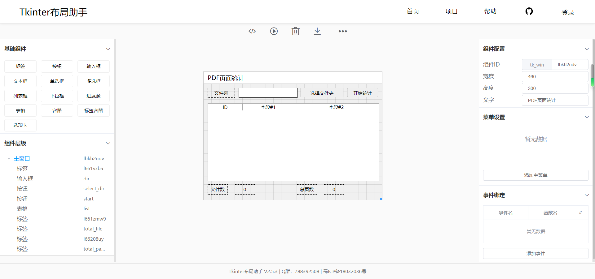
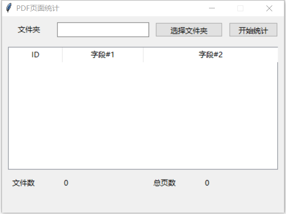

# Tkinter Helper（Tkinter布局助手）

>TkinterHelper（Tkinter布局助手）是一款为Tkinter打造，仅需拖拽组件进行布局，所见即所得，非常方便就能做出一个GUI界面，再配合 pyinstaller 库将程序打包成exe，简直是开发小工具的利器。

## 快速开始
[立即体验](https://www.pytk.net/tkinter-helper/)Tkinter布局助手， [在这](./files/demo.tk)可下载布局文件，并尝试在编辑器中导入，[查看](./files/demo.py)生成的python代码。

### 布局界面效果图


### win10下运行后效果图


### mac下运行效果

> 暂未截图，欢迎提PR

### linux下运行效果

>暂未截图，欢迎提PR

## Tkinter 简介
tkinter 是 Python 自带的标准库，因此无须另行安装，它支持跨平台运行，不仅可以在 Windows 平台上运行，还支持在 Linux 和 Mac 平台上运行。

## Tkinter适用场景
- 有Python基础，想做个图形化界面程序，但不会C++、C#。
- 简单的小工具、小程序开发。
- 程序需要给不懂编程的小白人员使用（例如外包、兼职场景）。
- 外观要求不高。

## Tkinter的缺点
- 对界面美观、性能、大小有要求的程序不适用。
- 打包成单个exe体积过大。

## 功能
- [x] 组件拖拽布局。
- [x] 即时生成代码，[实时预览](./files/preview.gif)。
- [x] 上下左右按键微调整组件位置。
- [x] 页面自动缓存布局数据，防止刷新丢失，可手动清理。
- [x] 布局文件导出、导入，方便二次修改。
- [ ] 容器组件嵌套
- [ ] pack布局(组件大小自适应)
- [ ] 设置组件默认值
- [ ] 事件绑定
- [ ] 菜单栏编辑
- [ ] 支持 ttkbootstrap 皮肤

## 目前支持的组件
- 标签
- 按钮
- 输入框
- 文本框
- 单选框
- 多选框
- 列表框
- 进度条(垂直/水平)
- 表格组件
- 容器(Frame)
- 标签容器(LabelFrame)
- 选项卡(Notebook)

## 实现原理

tinker有三种布局模式，pack() 按照组件添加的顺序布局，grid()网格布局，place()指定位置和大小，TkinterHelper则是采用的place()的布局方式，通过HTML的元素的绝对定位，拖拽组件到不同位置，记录相应的坐标位置和组件大小，再生成Python代码时再转为tinker的place布局方式。

## 代码生成规则
导出代码会构建一个视图类，类名 Win ，每一个组件生成一个私有方法，再构造函数中调用，并赋值到成员变量里，方便外部访问和调用。成员变量命名规则：组件类型+随机ID，这个ID可在页面上进行修改，建议按照功能命名，方便后面的事件绑定和其他逻辑的处理。
```python
from tkinter import *
from tkinter.ttk import *

class Win:
    def __init__(self):
        self.root = self.__win()
        self.tk_button_login = self.__tk_button_login()

    def __win(self):
        root = Tk()
        root.title("TkHelper 布局助手")
        # 设置大小 居中展示
        width = 600
        height = 500
        screenwidth = root.winfo_screenwidth()
        screenheight = root.winfo_screenheight()
        geometry = '%dx%d+%d+%d' % (width, height, (screenwidth - width) / 2, (screenheight - height) / 2)
        root.geometry(geometry)
        root.resizable(width=False, height=False)
        return root

    def show(self):
        self.root.mainloop()

    def __tk_button_login(self):
        btn = Button(self.root, text="登录")
        btn.place(x=180, y=180, width=215, height=31)
        return btn

if __name__ == "__main__":
    win = Win()
    # TODO 绑定点击事件或其他逻辑处理
    win.show()
```
## 使用方法

将生成的代码复制到你的编辑器中，执行这段代码就能看到界面的效果，如果程序较为简单，可在以下位置添加你的逻辑处理代码
```python
if __name__ == "__main__":
    win = Win()    # 实例化窗口界面
    # TODO 绑定点击事件或其他逻辑处理
    win.show()     # 展示界面
```

如果逻辑相对复杂可再其他python文件中导入该模块，再进行业务逻辑处理。

## 如何编译成exe
编译成exe需要用到 pyinstaller 库，安装好包后执行以下打包代码

```bash
pyinstaller ./view.py -F -w

# -F 打包成单个文件
# -w 不展示命令框
```

## 二次开发

本套系统基于Vue实现

```bash
# 安装依赖
npm install 

# 启动开发服务
npm run serve

# 打包
npm run build

```

## 交流群

QQ群: 788392508